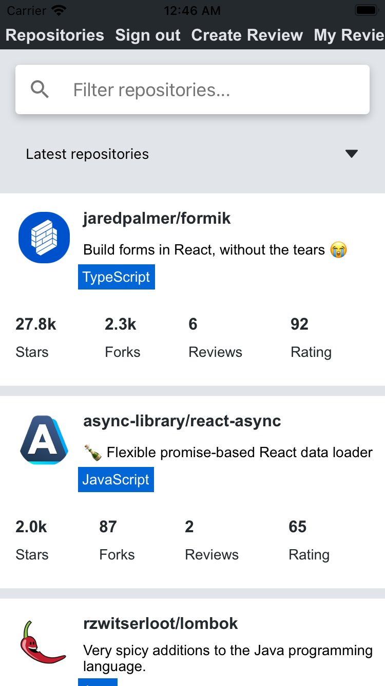
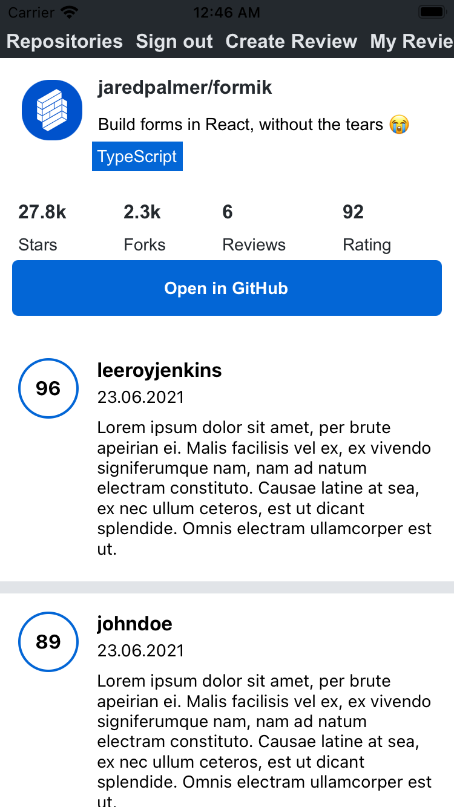
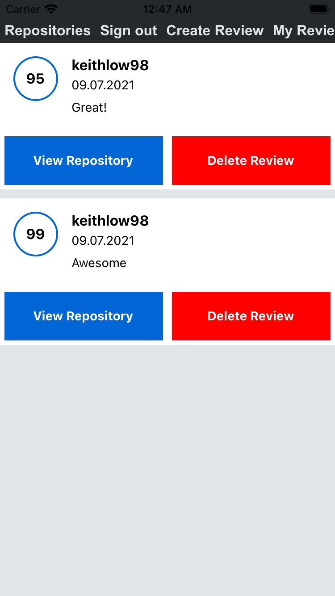

# github-rating

This app allows users to browse GitHub repositories pulled using the GitHub API,
including reviews made by other users. Users can also create an account to leave reviews. 

The backend can be found [here](https://github.com/fairyinabottle4/rate-repository-api)

A video demo can be found [here](https://youtu.be/1mFWByyV9LM)

## Some screenshots

Home page of the app
 
 
 

 
 
 
Reviews of a repository by other users
 
 
 

 
 
 
Reviews made by me
 
 
 

